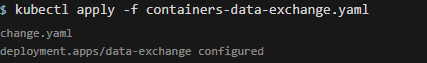

# Домашнее задание: Хранение в K8s

## Задание 1. Volume: обмен данными между контейнерами в поде

### Манифест containers-data-exchange.yaml

```yaml
apiVersion: apps/v1
kind: Deployment
metadata:
  name: data-exchange
spec:
  replicas: 1
  selector:
    matchLabels:
      app: data-exchange
  template:
    metadata:
      labels:
        app: data-exchange
    spec:
      containers:
      - name: busybox-writer
        image: busybox
        command: ["/bin/sh", "-c"]
        args: ["while true; do echo $(date) > /shared/data.txt; sleep 5; done"]
        volumeMounts:
        - name: shared-data
          mountPath: /shared
      - name: multitool-reader
        image: wbitt/network-multitool
        command: ["/bin/sh", "-c"]
        args: ["tail -f /shared/data.txt"]
        volumeMounts:
        - name: shared-data
          mountPath: /shared
      volumes:
      - name: shared-data
        emptyDir: {}
```

### Выполнение

Применение манифеста:


Проверка подов:


Описание пода:


Демонстрация чтения файла:

Результат: команда выполняется в фоне, показывая обновление файла каждые 5 секунд.

## Задание 2. PV, PVC

### Манифест pv-pvc.yaml

```yaml
---
apiVersion: v1
kind: PersistentVolume
metadata:
  name: local-pv
spec:
  capacity:
    storage: 1Gi
  volumeMode: Filesystem
  accessModes:
    - ReadWriteOnce
  persistentVolumeReclaimPolicy: Retain
  hostPath:
    path: /tmp/k8s-data
---
apiVersion: v1
kind: PersistentVolumeClaim
metadata:
  name: local-pvc
spec:
  volumeName: local-pv
  volumeMode: Filesystem
  accessModes:
    - ReadWriteOnce
  resources:
    requests:
      storage: 500Mi
  storageClassName: ""
---
apiVersion: apps/v1
kind: Deployment
metadata:
  name: data-exchange-pvc
spec:
  replicas: 1
  selector:
    matchLabels:
      app: data-exchange-pvc
  template:
    metadata:
      labels:
        app: data-exchange-pvc
    spec:
      containers:
      - name: busybox-writer
        image: busybox
        command: ["/bin/sh", "-c"]
        args: ["while true; do echo $(date) >> /data/data.txt; sleep 5; done"]
        volumeMounts:
        - name: local-storage
          mountPath: /data
      - name: multitool-reader
        image: wbitt/network-multitool
        command: ["/bin/sh", "-c"]
        args: ["tail -f /data/data.txt"]
        volumeMounts:
        - name: local-storage
          mountPath: /data
      volumes:
      - name: local-storage
        persistentVolumeClaim:
          claimName: local-pvc
```

### Шаг 2: Создание PV, PVC и Deployment


Проверка статуса:


### Шаг 3: Демонстрация чтения файла


Результат: команда выполняется в фоне, показывая обновление файла каждые 5 секунд.

### Шаг 4: Удаление Deployment и PVC


Проверка статуса PV:


### Шаг 5: Проверка файла и удаление PV

Файл сохранился на локальном диске ноды в директории `/tmp/k8s-data/data.txt`.

**Удаление**


### Объяснение поведения

1. **После удаления PVC**: PV переходит в статус `Released`, но не удаляется автоматически из-за политики `Retain`. Данные на диске остаются.

2. **После удаления PV**: Файл на локальном диске ноды остается, поскольку PV был hostPath типом и только ссылался на существующую директорию на хосте. Удаление PV не затрагивает реальные файлы на диске.

## Задание 3. StorageClass

### Манифест sc.yaml

```yaml
apiVersion: storage.k8s.io/v1
kind: StorageClass
metadata:
  name: local-storage-class
provisioner: kubernetes.io/no-provisioner
volumeBindingMode: WaitForFirstConsumer
---
apiVersion: v1
kind: PersistentVolume
metadata:
  name: sc-pv
spec:
  capacity:
    storage: 1Gi
  volumeMode: Filesystem
  accessModes:
    - ReadWriteOnce
  persistentVolumeReclaimPolicy: Retain
  storageClassName: local-storage-class
  hostPath:
    path: /tmp/k8s-sc-data
---
apiVersion: v1
kind: PersistentVolumeClaim
metadata:
  name: sc-pvc
spec:
  volumeMode: Filesystem
  accessModes:
    - ReadWriteOnce
  resources:
    requests:
      storage: 500Mi
  storageClassName: local-storage-class
---
apiVersion: apps/v1
kind: Deployment
metadata:
  name: data-exchange-sc
spec:
  replicas: 1
  selector:
    matchLabels:
      app: data-exchange-sc
  template:
    metadata:
      labels:
        app: data-exchange-sc
    spec:
      containers:
      - name: busybox-writer
        image: busybox
        command: ["/bin/sh", "-c"]
        args: ["while true; do echo $(date) >> /data/data.txt; sleep 5; done"]
        volumeMounts:
        - name: sc-storage
          mountPath: /data
      - name: multitool-reader
        image: wbitt/network-multitool
        command: ["/bin/sh", "-c"]
        args: ["tail -f /data/data.txt"]
        volumeMounts:
        - name: sc-storage
          mountPath: /data
      volumes:
      - name: sc-storage
        persistentVolumeClaim:
          claimName: sc-pvc
```

### Шаг 2: Создание SC, PVC и Deployment


Проверка статуса:


### Шаг 3: Демонстрация чтения файла


Результат: команда выполняется в фоне, показывая обновление файла каждые 5 секунд.
